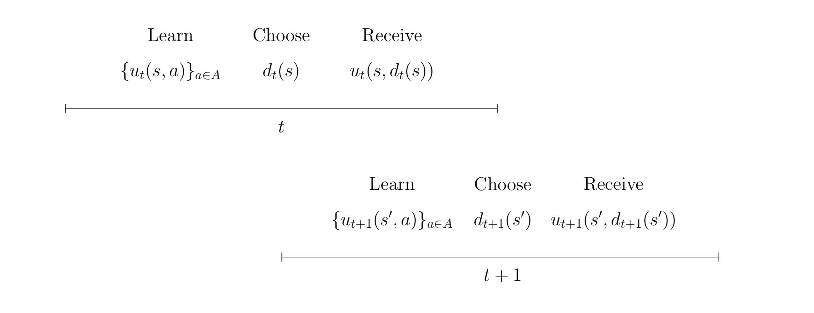

Economic Model
===============

This part of the documentation contains detailed information on the economic model. In particular, it discusses all assumptions on primitives we base our computational model on, e.g., preference structure, attitutes towards risk, beliefs regarding key variables, etc.

At time :math:`t= 1,..., T` each individual observes the state of the economic environment :math:`s \in S` and chooses an action :math:`a` from the set of admissible actions :math:`A`. The decision has two consequences: an individual receives an immediate utility :math:`u_t(s,a)` and the economy evolves to a new state :math:`s'`. The transition from :math:`s` to :math:`s'` is affected by the action. Individuals are forward-looking, thus they do not simply choose the alternative with the highest immediate utility. Instead, they take the future consequences of their current action into account.

The above figure depicts the timing of events in the model for two generic time periods. At the beginning of each period :math:`t` an individual fully learns about the immediate utility of each alternative, chooses one of them, and receives its immediate utility. Then the state evolves from :math:`s` to :math:`s'` and the process is repeated in :math:`t + 1`.

A decision rule :math:`d_t` specifies the action at a particular time :math:`t` for any possible state. A policy :math:`\pi = (d_1,..., d_T)` provides the individual with a prescription for choosing an action in any possible future state. It is a sequence of decision rules and its implementation generates a sequence of utilities. The evolution of states over time is at least partly unknown as future utilities depend on, for example, shocks to preferences. Let :math:`X_t` denote the random variable for the state at time :math:`t`.

In this life cycle model, individuals make their decisions facing risk. Agents have rational expectations and thus rational choices are expressed by expected utility preferences. In a static setting, individuals in state :math:$s$ rank each action :math:$a$ according to the criterion formalized in the equation below:

.. math::
    v_{T - 1}(s, a) = \int_S \:u_T(s^\prime, d_T(s^\prime))\: dp_{T - 1}(s, a)

In a dynamic setting, individuals maximize their total doscounted utility. A constant discount factor ensures dynamic consistency of preferences as the individual’s future actions agree with the planned-for contingencies.

.. math::
    v^{\pi^*}_1(s) = \max_{\pi \in \Pi} E_{s}^\pi\left[\sum^{T}_{t = 1}  \delta^{t - 1} u_t(X_t, d_t(X_t))\right]

The above equation provides the formal representation of the individual's objective. Given an initial state :math:`s`, individuals seek to implement the optimal policy :math:`\pi^*` from the set of all possible policies :math:`\Pi` that maximizes the expected total discounted utility over all :math:`T`.