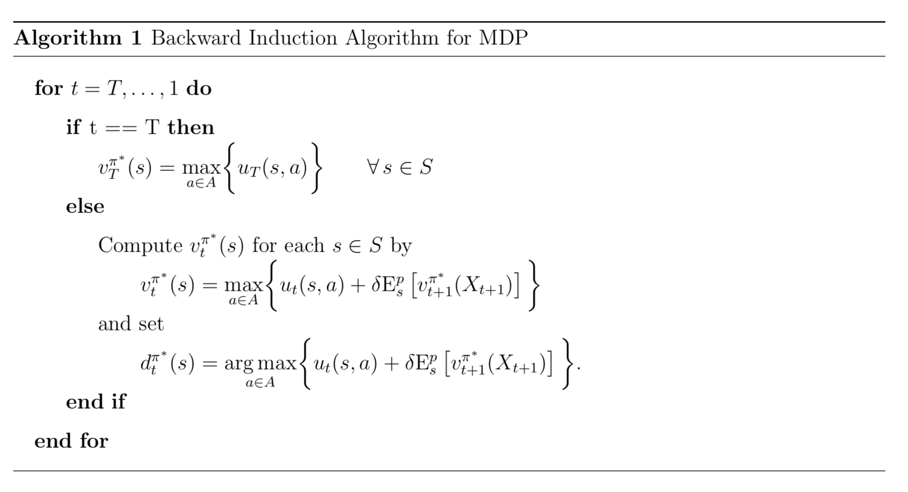

Mathematical Model
===================

This part of the documentation addresses the mathematical model we apply to the economic problem. In particular, it presents the details of the Markov decision process which we use to analyse agents' life-cycle employment decisions.

The life cycle model of human capital investment subject to the analysis at hand is set up as a standard MDP where there is a unique transition probability distribution :math:`p_t(s, a)` associated with each state and action.

Let the sequence of previous states and decisions up to time :math:`t` be denoted by :math:`h_t \equiv (s_1, a_1, ..., s_{t -1}, a_{t - 1}, s_t)` and :math:`\mathcal{H}_T` be the set of all possible histories over the :math:`T` decision periods.

When making sequential decisions in this model, the task is to determine the optimal policy :math:`\pi^*` with the largest expected total discounted utility :math:`v^{\pi^*}_1`. In principle, this requires to evaluate the performance of all policies based on all possible sequences of utilities and the probability that each occurs. Fortunately, however, the multistage problem can be solved by a sequence of simpler inductively defined single-stage problems.

Let :math:`v^\pi_t(s)` denote the expected total discounted utility under :math:`\pi` from period :math:`t` onwards:

.. math::

    v^\pi_t(s) = E^\pi_{s}\left[ \sum^T_{\tau=t} \delta^{\tau - t}   u_\tau(X_\tau, d_\tau(X_\tau)) \right].

Then :math:`v_1^\pi(s)` can be determined for any policy by recursively evaluating the equation:

.. math::

    v^\pi_t(s) = u_t(s, d_t(s)) + \delta E^p_{s} \left[v^\pi_{t + 1}(X_{t + 1})\right].

The above equation expresses the utility :math:`v^\pi_t(s)` of adopting policy :math:`\pi` going forward as the sum of its immediate utility and all expected discounted future utilities.

The principle of optimality (see Bellman, 1957) allows to construct the optimal policy :math:`\pi^*` by solving the optimality equations for all :math:`s` and :math:`t` in equation below recursively:

.. math::

    v^{\pi^*}_t(s) = \max_{a \in A}\bigg\{ u_t(s, a) + \delta E^p_{s} \left[v^{\pi^*}_{t + 1}(X_{t + 1})\right] \bigg\}.

The value function :math:`v^{\pi^*}_t` is the expected discounted utility in :math:`t` over the remaining time horizon assuming the optimal policy is implemented going forward.

The algorithm presented below allows to solve the MDP by a simple backward induction procedure. In the final period :math:`T`, there is no future to take into account and so the optimal decision is simply to choose the alternative with the highest immediate utility in each state. With the results for the final period at hand, the other optimal decisions can be determined recursively as the calculation of their expected future utility is straightforward given the relevant transition probability distribution.

